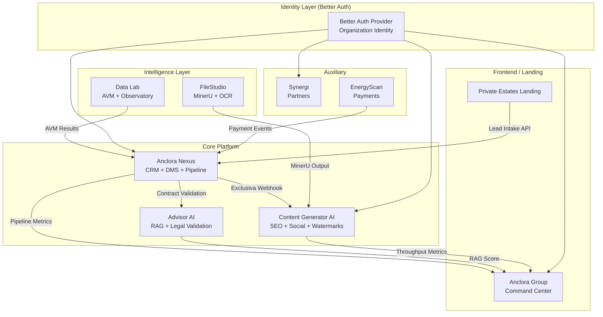
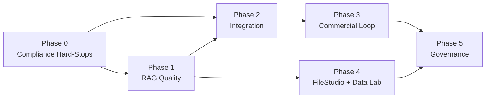

# Design Document: Ecosystem Consolidation Plan

## Overview

This design defines the architecture, integration patterns, and implementation strategy for the 6-phase consolidation of the Anclora Group PropTech ecosystem. The plan addresses compliance hard-stops (Phase 0), RAG quality improvements (Phase 1), service integration (Phase 2), commercial loop closure (Phase 3), document intelligence (Phase 4), and governance infrastructure (Phase 5).

The consolidation spans 11 repositories that today operate largely in isolation. The design establishes shared contracts, event-driven communication patterns, and a unified identity layer that progressively bind these services into a coherent platform — while respecting each repo's independent deployment topology and data isolation boundaries.

### Design Principles

1. **Loose coupling via contracts**: Services communicate through versioned API contracts and webhook signatures, never through shared databases.
2. **Progressive integration**: Each phase delivers independently deployable value. No phase blocks on another except where explicitly marked as a dependency.
3. **Compliance by construction**: Regulatory requirements (AI Act, AML, PSD2, GDPR) are embedded in data models and enforcement logic, not post-hoc documentation.
4. **Single source of truth per domain**: Each piece of data has exactly one authoritative service. Other services receive events or query the owner.

---

## Architecture

### High-Level System Topology



### Phase Dependency Graph



### Deployment Topology (unchanged per repo)

| Repository                      | Frontend               | Backend                 | Database                        | Auth                   |
| ------------------------------- | ---------------------- | ----------------------- | ------------------------------- | ---------------------- |
| anclora-nexus                   | Vercel                 | Render (FastAPI)        | Supabase PG                     | Supabase → Better Auth |
| anclora-advisor-ai              | Vercel                 | Next.js API routes      | Supabase (lvpplnqbyvscpuljnzqf) | Supabase               |
| anclora-content-generator-ai    | Vercel                 | Next.js + Hermes Worker | Neon + pgvector                 | Better Auth            |
| anclora-filestudio              | Self-hosted / Portable | Next.js API routes      | SQLite                          | None (local)           |
| anclora-data-lab                | Vercel                 | Next.js                 | Neon                            | TBD                    |
| anclora-synergi                 | Vercel                 | Next.js                 | Neon                            | Better Auth            |
| anclora-energyscan              | Vercel                 | Next.js                 | Stripe + local                  | TBD                    |
| anclora-group                   | Vercel                 | Next.js                 | Neon                            | Better Auth            |
| anclora-private-estates-landing | Vercel                 | Static + form handler   | None                            | None                   |

---

## Components and Interfaces

### Phase 0 Components

#### 0.1 Advisor AI Build Pipeline

- **Location**: `anclora-advisor-ai/.github/workflows/ci.yml`
- **Responsibility**: Gate `type-check`, `lint`, `build` on every PR
- **Interface**: Standard GitHub Actions CI with fail-fast

#### 0.2 AI Act Art. 50 Disclaimer Module

- **Location**: `anclora-advisor-ai/src/components/features/disclaimer/`
- **Responsibility**: Inject conversational disclaimer on session start; persistent AI indicator in chat UI; legal recommendation footer
- **Interface**: React component wrapping chat output

#### 0.3 AML Vault Schema

- **Location**: `anclora-nexus/supabase/migrations/NNN_aml_vault_schema.sql`
- **Responsibility**: Dedicated Supabase schema with retention enforcement
- **Interface**:
  ```sql
  CREATE SCHEMA IF NOT EXISTS aml_vault;
  -- Tables: aml_vault.retention_records, aml_vault.access_log
  -- RLS: deny all from marketing/analytics roles
  ```

#### 0.4 Payment Decision ADR

- **Location**: `anclora-group/docs/adr/ADR-001-payment-mechanism.md`
- **Responsibility**: Binding architectural decision record for Stripe Connect vs escrow
- **Interface**: Document artifact (no code interface)

### Phase 1 Components

#### 1.1 RAG Source Auditor

- **Location**: `anclora-advisor-ai/lib/rag/source-auditor.ts`
- **Responsibility**: Scan knowledge base, score sources, purge below threshold
- **Interface**:
  ```typescript
  interface SourceAuditResult {
    source_id: string;
    relevance_score: number;
    action: "keep" | "purge";
    reason: string;
  }
  function auditSources(threshold: number): Promise<SourceAuditResult[]>;
  function purgeSources(sourceIds: string[]): Promise<void>;
  ```

#### 1.2 Territorial Intelligence Ingestion Pipeline

- **Location**: `anclora-advisor-ai/lib/rag/territorial-ingestion.ts`
- **Responsibility**: Watch ingestion folder, validate scope governance, index into RAG
- **Interface**:
  ```typescript
  interface IngestionResult {
    document_id: string;
    notebook_id: string;
    domain: string;
    reason_for_fit: string;
    status: "ingested" | "rejected";
    rejection_reason?: "SOURCE_SCOPE_MISMATCH" | "LOW_RELEVANCE";
  }
  ```

#### 1.3 RAG Evaluation Pipeline

- **Location**: `anclora-advisor-ai/lib/rag/evaluation-pipeline.ts`
- **Responsibility**: Benchmark RAG responses, compute composite score, gate deployments
- **Interface**:
  ```typescript
  interface EvaluationResult {
    composite_score: number; // 0.0 - 1.0
    passed: boolean; // score >= 0.7
    details: {
      question: string;
      expected: string;
      actual: string;
      score: number;
    }[];
  }
  ```

#### 1.4 NotebookLM Sync CLI

- **Location**: `anclora-nexus/backend/cli/notebooklm_sync.py`
- **Responsibility**: CLI wrapper for existing build/validate scripts with manifest tracking
- **Interface**:
  ```python
  # CLI: python -m cli.notebooklm_sync --validate --push
  class SyncManifest:
      notebook_id: str
      entries: list[ManifestEntry]  # document_hash, sync_timestamp
  ```

### Phase 2 Components

#### 2.1 Contract Validator Service (Nexus side)

- **Location**: `anclora-nexus/backend/services/advisor_contract_validator_service.py`
- **Responsibility**: Call Advisor AI validation endpoint, handle responses, manage retries
- **Interface**:

  ```python
  class ContractValidationRequest(BaseModel):
      document_id: str
      document_content: str
      document_type: str
      org_id: str

  class ContractValidationResponse(BaseModel):
      document_id: str
      block_signing: bool
      issues: list[ValidationIssue]
      confidence: float
  ```

#### 2.2 Legal Document Validation Endpoint (Advisor AI side)

- **Location**: `anclora-advisor-ai/src/app/api/legal-documents/validate/route.ts`
- **Responsibility**: Receive document, run RAG-powered legal analysis, return validation result
- **Interface**: `POST /api/legal-documents/validate`
  - Auth: `X-Advisor-Internal-API-Key` header
  - Request: `{ document_id, document_content, document_type }`
  - Response: `{ document_id, block_signing, issues[], confidence }`

#### 2.3 Signature Blocking Propagation

- **Location**: `anclora-nexus/backend/services/dms_signature_service.py`
- **Responsibility**: Update DMS status on block/unblock events within 5s SLA
- **Interface**:
  ```python
  class SignatureBlockEvent:
      document_id: str
      block_signing: bool
      reason: str
      timestamp: datetime
      hmac_signature: str  # HMAC-SHA256 of event payload
  ```

### Phase 3 Components

#### 3.1 Lead Intake API

- **Location**: `anclora-nexus/backend/api/routes/lead_intake.py`
- **Responsibility**: Accept leads from external sources, validate, deduplicate, assign temperature
- **Interface**: `POST /api/v1/leads/intake`

  ```python
  class LeadIntakeRequest(BaseModel):
      contact: ContactInfo  # name, email, phone
      source_system: str    # e.g., "private-estates-landing"
      source_channel: str   # e.g., "form-main", "whatsapp"
      timestamp: datetime
      metadata: dict | None

  class LeadIntakeResponse(BaseModel):
      lead_id: str
      status: Literal["created", "duplicate"]
      temperature: Literal["cold", "warm", "hot"]
  ```

#### 3.2 Exclusiva Webhook Dispatcher

- **Location**: `anclora-nexus/backend/services/webhook_dispatcher.py`
- **Responsibility**: Send signed webhook to Content Generator AI when property reaches "Exclusiva"
- **Interface**:
  ```python
  class PropertyWebhookPayload(BaseModel):
      property_id: str
      description: str
      media_urls: list[str]
      location: LocationInfo
      features: dict
      event_type: Literal["exclusiva_created"]
      timestamp: datetime
      signature: str  # HMAC-SHA256
  ```

#### 3.3 Content Generation Job Receiver

- **Location**: `anclora-content-generator-ai/src/app/api/webhooks/property/route.ts`
- **Responsibility**: Validate webhook signature, create content generation job
- **Interface**: `POST /api/webhooks/property`
  - Validates `X-Webhook-Signature` header (HMAC-SHA256)
  - Creates jobs for SEO listing + social posts

#### 3.4 Better Auth Unified Provider

- **Location**: `anclora-group/src/lib/auth/` (shared config)
- **Responsibility**: Organization-level identity, SSO across Nexus/Content/Synergi
- **Interface**:
  ```typescript
  interface OrganizationIdentity {
    org_id: string;
    org_name: string;
    members: { user_id: string; role: OrgRole; apps: AppAccess[] }[];
  }
  type OrgRole = "group-admin" | "app-admin" | "operator" | "viewer";
  ```

### Phase 4 Components

#### 4.1 MinerU Property Dossier Processor

- **Location**: `anclora-filestudio/src/lib/engines/mineru/property-dossier.ts`
- **Responsibility**: Process property document bundles, extract structured entities
- **Interface**:
  ```typescript
  interface PropertyDossier {
    document_id: string;
    parsed_text: string;
    entities: {
      address?: string;
      cadastral_reference?: string;
      surface_m2?: number;
      price?: number;
      document_classification: string;
    };
    token_reduction_pct: number; // target >= 70%
    precision_level: "full" | "reduced";
  }
  ```

#### 4.2 RAG Ingestion from MinerU Output

- **Location**: `anclora-content-generator-ai/lib/rag/mineru-ingestion.ts`
- **Responsibility**: Receive MinerU output, chunk, embed, store in pgvector with deduplication
- **Interface**:
  ```typescript
  interface RagChunk {
    chunk_id: string;
    content: string;
    content_hash: string; // SHA-256 for dedup
    embedding: number[]; // vector
    metadata: {
      document_id: string;
      page_number: number;
      extraction_timestamp: string;
    };
  }
  ```

#### 4.3 AVM Mallorca Model

- **Location**: `anclora-data-lab/src/lib/avm/mallorca-model.ts`
- **Responsibility**: Consume observatory + deal margin data, produce valuations with confidence
- **Interface**:
  ```typescript
  interface AVMRequest {
    property_location: { lat: number; lng: number; municipality: string };
    property_type: string;
    surface_m2: number;
    features: Record<string, unknown>;
  }
  interface AVMResponse {
    estimated_value: number;
    confidence_interval: { low: number; high: number };
    confidence_level: "high" | "medium" | "low";
    data_sources_used: string[];
    comparable_count: number;
  }
  ```

### Phase 5 Components

#### 5.1 AI Act Art. 6.3 Exclusion Registry

- **Location**: `anclora-group/docs/compliance/ai-act-art6-3-talent-exclusion.md`
- **Responsibility**: Formal exclusion documentation for Talent module
- **Interface**: Document artifact with structured fields (system description, purpose, impact assessment, reasoning)

#### 5.2 Cryptographic Watermark Engine

- **Location**: `anclora-content-generator-ai/lib/watermark/crypto-watermark.ts`
- **Responsibility**: Embed and verify cryptographic watermarks in generated PDFs
- **Interface**:

  ```typescript
  interface WatermarkPayload {
    generation_timestamp: string;
    model_version: string;
    workspace_id: string;
    document_hash: string;
  }
  function embedWatermark(
    pdf: Buffer,
    payload: WatermarkPayload,
    signingKey: string,
  ): Promise<Buffer>;
  function verifyWatermark(
    pdf: Buffer,
    signingKey: string,
  ): Promise<WatermarkVerification>;

  interface WatermarkVerification {
    valid: boolean;
    status: "authentic" | "tampered" | "no_watermark";
    payload?: WatermarkPayload;
  }
  ```

#### 5.3 Command Center Aggregator

- **Location**: `anclora-group/src/app/command-center/`
- **Responsibility**: Poll/receive health status and metrics from all ecosystem apps
- **Interface**:
  ```typescript
  interface EcosystemHealthStatus {
    applications: {
      app_id: string;
      status: "healthy" | "degraded" | "error";
      last_check: string;
      metrics: Record<string, number>;
    }[];
    alerts: Alert[];
  }
  ```

---

## Data Models

### AML Vault Schema (Phase 0)

```sql
CREATE SCHEMA IF NOT EXISTS aml_vault;

CREATE TABLE aml_vault.retention_records (
    id UUID PRIMARY KEY DEFAULT gen_random_uuid(),
    org_id UUID NOT NULL,
    source_table TEXT NOT NULL,
    source_record_id UUID NOT NULL,
    record_data JSONB NOT NULL,
    classification_reason TEXT NOT NULL,
    created_at TIMESTAMPTZ NOT NULL DEFAULT now(),
    retention_expires_at TIMESTAMPTZ NOT NULL, -- created_at + 10 years
    review_status TEXT DEFAULT 'active' CHECK (review_status IN ('active', 'pending_review', 'deleted')),
    CONSTRAINT retention_not_expired CHECK (retention_expires_at > created_at)
);

CREATE TABLE aml_vault.access_log (
    id UUID PRIMARY KEY DEFAULT gen_random_uuid(),
    record_id UUID REFERENCES aml_vault.retention_records(id),
    accessed_by UUID NOT NULL,
    access_type TEXT NOT NULL CHECK (access_type IN ('read', 'audit')),
    accessed_at TIMESTAMPTZ NOT NULL DEFAULT now(),
    access_reason TEXT NOT NULL
);

-- RLS: deny marketing and analytics roles
ALTER TABLE aml_vault.retention_records ENABLE ROW LEVEL SECURITY;
CREATE POLICY vault_compliance_only ON aml_vault.retention_records
    FOR ALL USING (auth.role() IN ('compliance_officer', 'service_role'));

-- Prevent deletion of non-expired records
CREATE OR REPLACE FUNCTION aml_vault.prevent_premature_deletion()
RETURNS TRIGGER AS $$
BEGIN
    IF OLD.retention_expires_at > now() AND OLD.review_status = 'active' THEN
        RAISE EXCEPTION 'Cannot delete record before retention period expires';
    END IF;
    RETURN OLD;
END;
$$ LANGUAGE plpgsql;

CREATE TRIGGER prevent_early_delete
    BEFORE DELETE ON aml_vault.retention_records
    FOR EACH ROW EXECUTE FUNCTION aml_vault.prevent_premature_deletion();
```

### Lead Pipeline Schema (Phase 3)

```sql
CREATE TABLE leads (
    id UUID PRIMARY KEY DEFAULT gen_random_uuid(),
    org_id UUID NOT NULL,
    contact_name TEXT NOT NULL,
    contact_email TEXT,
    contact_phone TEXT,
    source_system TEXT NOT NULL,
    source_channel TEXT NOT NULL,
    temperature TEXT NOT NULL DEFAULT 'cold' CHECK (temperature IN ('cold', 'warm', 'hot')),
    assigned_owner UUID,
    next_action TEXT,
    next_action_due TIMESTAMPTZ,
    status TEXT NOT NULL DEFAULT 'new' CHECK (status IN ('new', 'contacted', 'qualified', 'converted', 'lost', 'stale')),
    created_at TIMESTAMPTZ NOT NULL DEFAULT now(),
    updated_at TIMESTAMPTZ NOT NULL DEFAULT now(),
    metadata JSONB,
    UNIQUE(org_id, contact_email, source_system)
);

CREATE INDEX idx_leads_temperature ON leads(org_id, temperature);
CREATE INDEX idx_leads_stale ON leads(org_id, status, next_action_due)
    WHERE status NOT IN ('converted', 'lost');
```

### DMS Signature Status (Phase 2)

```sql
ALTER TABLE documents ADD COLUMN IF NOT EXISTS
    signature_status TEXT DEFAULT 'ready_for_signature'
    CHECK (signature_status IN ('ready_for_signature', 'signature_blocked', 'signed'));

ALTER TABLE documents ADD COLUMN IF NOT EXISTS
    block_reason TEXT;

ALTER TABLE documents ADD COLUMN IF NOT EXISTS
    block_source TEXT; -- 'advisor_ai_validation'
```

### Audit Log Extension (Phase 2)

```sql
-- Existing audit_log table extended with block/unblock events
-- All entries signed with HMAC-SHA256 per constitutional requirements
CREATE TABLE IF NOT EXISTS audit_log (
    id UUID PRIMARY KEY DEFAULT gen_random_uuid(),
    org_id UUID NOT NULL,
    event_type TEXT NOT NULL,
    entity_type TEXT NOT NULL,
    entity_id UUID NOT NULL,
    actor_id UUID,
    payload JSONB NOT NULL,
    hmac_signature TEXT NOT NULL, -- HMAC-SHA256(payload, INTERNAL_AUDIT_SECRET)
    created_at TIMESTAMPTZ NOT NULL DEFAULT now()
);
```

### RAG Chunks Schema (Phase 4 — Content Generator AI / Neon)

```sql
CREATE TABLE rag_chunks (
    id UUID PRIMARY KEY DEFAULT gen_random_uuid(),
    workspace_id UUID NOT NULL,
    content TEXT NOT NULL,
    content_hash TEXT NOT NULL UNIQUE, -- SHA-256 for deduplication
    embedding vector(384) NOT NULL, -- Transformers.js dimension
    document_id TEXT NOT NULL,
    page_number INTEGER,
    extraction_timestamp TIMESTAMPTZ NOT NULL,
    source_engine TEXT DEFAULT 'mineru',
    created_at TIMESTAMPTZ NOT NULL DEFAULT now()
);

CREATE INDEX idx_rag_chunks_embedding ON rag_chunks
    USING ivfflat (embedding vector_cosine_ops) WITH (lists = 100);
CREATE INDEX idx_rag_chunks_hash ON rag_chunks(content_hash);
```

### NotebookLM Sync Manifest (Phase 1)

```python
# Stored as JSON file: notebooklm_manifest.json
class ManifestEntry(BaseModel):
    document_id: str
    document_hash: str  # SHA-256 of document content
    notebook_id: str
    domain: str
    sync_timestamp: datetime
    status: Literal["synced", "pending", "failed"]
```

### Better Auth Organization Model (Phase 3/5)

```typescript
interface Organization {
  id: string;
  name: string;
  slug: string;
  created_at: string;
}

interface OrganizationMember {
  user_id: string;
  org_id: string;
  role: "group-admin" | "app-admin" | "operator" | "viewer";
  app_permissions: {
    app_id: string; // nexus, content-gen, synergi, command-center
    role_override?: string;
  }[];
  active: boolean;
  joined_at: string;
}
```

---

## Correctness Properties

_A property is a characteristic or behavior that should hold true across all valid executions of a system — essentially, a formal statement about what the system should do. Properties serve as the bridge between human-readable specifications and machine-verifiable correctness guarantees._

### Property 1: AML Vault Retention Timestamp Correctness

_For any_ transaction record classified as AML-relevant, storing it in the AML vault shall produce a record whose `retention_expires_at` equals `created_at + 10 years` exactly.

**Validates: Requirements 3.2**

### Property 2: AML Vault Deletion Prevention

_For any_ record in the AML vault whose `retention_expires_at > now()`, any attempt to delete that record shall raise an error and leave the record unchanged.

**Validates: Requirements 3.3**

### Property 3: RAG Source Audit Threshold Classification

_For any_ set of RAG sources with known relevance scores, calling `auditSources(threshold)` shall mark every source with `relevance_score < threshold` as `action: 'purge'` and every source with `relevance_score >= threshold` as `action: 'keep'`.

**Validates: Requirements 5.1, 5.2**

### Property 4: RAG Post-Purge Referential Integrity

_For any_ knowledge base state after a purge operation, all chunk references shall point to sources that still exist in the knowledge base (no orphaned references).

**Validates: Requirements 5.3**

### Property 5: NotebookLM Scope Governance Validation

_For any_ document submitted for ingestion or sync, the validation function shall accept the document if and only if its `domain` matches the allowed scope of the target `notebook_id`. Documents with mismatched scope shall be rejected with `SOURCE_SCOPE_MISMATCH`.

**Validates: Requirements 6.2, 8.2, 8.3**

### Property 6: RAG Retrieval Minimum Relevance

_For any_ query submitted to the territorial intelligence RAG, all chunks returned in the result set shall have a `relevance_score >= 0.7`.

**Validates: Requirements 6.3**

### Property 7: RAG Evaluation Score Bounded and Gated

_For any_ evaluation pipeline execution, the composite score shall be in the range `[0.0, 1.0]`, and if the score is below `0.7` then the deployment gate shall be blocked and an alert emitted.

**Validates: Requirements 7.2, 7.3**

### Property 8: Document Validation Block Propagation

_For any_ contract validation response from Advisor AI, the DMS document status shall be `"signature_blocked"` if and only if `block_signing === true`. When `block_signing === false`, the document status shall be `"ready_for_signature"`.

**Validates: Requirements 10.3, 10.4**

### Property 9: API Key Authentication Enforcement

_For any_ request to the Advisor AI internal API, if the `X-Advisor-Internal-API-Key` header is missing or does not match the configured key, the response shall be HTTP 401 Unauthorized.

**Validates: Requirements 11.2**

### Property 10: Signature Block/Unblock Round-Trip with Audit

_For any_ document, blocking (setting `block_signing=true`) and then unblocking (setting `block_signing=false`) shall restore the document to `"ready_for_signature"` status. Every block and unblock event shall produce an `audit_log` entry with a valid HMAC-SHA256 signature over the event payload.

**Validates: Requirements 12.3, 12.4**

### Property 11: Lead Intake Validation

_For any_ lead intake request, if any required field (`contact`, `source_system`, `source_channel`, `timestamp`) is missing or empty, the request shall be rejected with HTTP 400. If all fields are present and valid, the lead shall be created with status `"new"` and a temperature assignment.

**Validates: Requirements 13.2, 13.3**

### Property 12: Lead Deduplication Within 24-Hour Window

_For any_ two lead intake requests with identical `contact_email` and `source_system` arriving within a 24-hour window, the second request shall be rejected with a `"duplicate"` status. Requests arriving after the 24-hour window shall be accepted as new leads.

**Validates: Requirements 13.4**

### Property 13: Lead Staleness Detection

_For any_ lead with no `next_action_due` set and `created_at` older than 48 hours, the staleness check shall flag the lead with status `"stale"` and alert the assigned owner.

**Validates: Requirements 14.4**

### Property 14: Webhook HMAC Signature Verification

_For any_ incoming webhook payload, the Content Generator AI shall accept the webhook if and only if `HMAC-SHA256(payload, shared_secret)` equals the provided `X-Webhook-Signature` header value.

**Validates: Requirements 15.2**

### Property 15: Cryptographic Watermark Round-Trip

_For any_ valid PDF content and watermark payload, calling `embedWatermark(pdf, payload, key)` followed by `verifyWatermark(result, key)` shall return `{ valid: true, status: 'authentic' }` with the original payload fields intact.

**Validates: Requirements 21.1, 21.3**

### Property 16: Watermark Tamper Detection

_For any_ watermarked PDF, if any byte of the PDF content is modified after watermark embedding, `verifyWatermark(modified_pdf, key)` shall return `{ valid: false, status: 'tampered' }`.

**Validates: Requirements 21.4**

### Property 17: Content Hash Deduplication

_For any_ RAG chunk content, the system shall store exactly one entry per unique `SHA-256(content)`. Attempting to store a second chunk with identical content hash shall be rejected or ignored without creating a duplicate.

**Validates: Requirements 18.4**

### Property 18: AVM Confidence Gating

_For any_ property valuation request where the number of comparable transactions in the area is fewer than 10, the AVM response shall include `confidence_level: "low"` and a non-empty explanation of the data gap.

**Validates: Requirements 19.4**

### Property 19: AVM Geographic Boundary Enforcement

_For any_ valuation request with a location outside the Mallorca geographic boundary, the system shall reject the request or return an error indicating the area is not supported.

**Validates: Requirements 19.3**

### Property 20: Role Hierarchy Permission Superset

_For any_ two roles where role A is higher than role B in the hierarchy (group-admin > app-admin > operator > viewer), the permission set of role A shall be a strict superset of the permission set of role B.

**Validates: Requirements 23.3**

### Property 21: Session Invalidation on User Deactivation

_For any_ user with active sessions, when that user is deactivated at organization level, all previously valid session tokens shall immediately return unauthorized on subsequent validation attempts.

**Validates: Requirements 23.4**

---

## Error Handling

### Cross-Service Communication Failures

| Scenario                              | Handling Strategy                                                                                              | Affected Components       |
| ------------------------------------- | -------------------------------------------------------------------------------------------------------------- | ------------------------- |
| Advisor AI unreachable from Nexus     | Queue document for retry (exponential backoff, max 3 retries over 1 hour). Notify operator via Command Center. | Nexus → Advisor AI        |
| Webhook delivery to Content Gen fails | Retry with exponential backoff (3 retries over 1 hour). Log failure in audit_log.                              | Nexus → Content Gen AI    |
| MinerU processing fails               | Fall back to Tesseract OCR, flag output as `"reduced_precision"`.                                              | FileStudio                |
| Better Auth token validation fails    | Return 401; if service itself is down, degrade gracefully with cached session state for up to 5 minutes.       | All Better Auth consumers |
| Command Center health poll fails      | Mark application as "unknown" status after 3 consecutive failures. Display "last known" state with timestamp.  | Command Center            |

### Data Integrity Failures

| Scenario                                           | Handling Strategy                                                                              |
| -------------------------------------------------- | ---------------------------------------------------------------------------------------------- |
| AML vault deletion attempted on non-expired record | PostgreSQL trigger raises exception; operation is rolled back.                                 |
| Duplicate lead within 24h window                   | Return HTTP 409 Conflict with existing lead_id. No new record created.                         |
| RAG chunk content hash collision                   | `INSERT ... ON CONFLICT (content_hash) DO NOTHING` — idempotent, no error surfaced.            |
| Invalid HMAC on incoming webhook                   | Return HTTP 401; log suspicious request with source IP. Do not process payload.                |
| Watermark verification on unmodified PDF fails     | Return `"tampered"` status — false positives are preferable to false negatives for compliance. |

### Graceful Degradation

- **RAG evaluation below threshold**: Block new deployments but keep existing deployment running. Alert via Command Center.
- **AVM insufficient data**: Return result with `confidence_level: "low"` and explanation, never silently produce a "high confidence" estimate.
- **NotebookLM scope validation failure**: Reject the specific document, not the entire batch. Continue processing valid documents.
- **Supabase Auth → Better Auth migration**: 30-day dual-auth window where both token types are accepted.

---

## Testing Strategy

### Dual Testing Approach

This ecosystem consolidation requires both unit/integration tests (for specific interactions) and property-based tests (for universal logic correctness).

**Property-Based Testing** applies to the pure logic components:

- RAG source audit classification
- Lead intake validation and deduplication
- HMAC signature generation and verification
- Watermark embed/verify round-trip
- Content hash deduplication
- AVM confidence gating and geographic boundary checks
- Role hierarchy permission validation
- AML retention enforcement logic
- Document status state machine transitions

**Integration Testing** applies to cross-service interactions:

- Nexus → Advisor AI contract validation calls
- Nexus → Content Generator AI webhook delivery
- FileStudio → Content Gen RAG ingestion pipeline
- Command Center → all applications health polling
- Better Auth SSO token acceptance across applications
- Lead intake from Private Estates Landing to Nexus

**Smoke Testing** applies to infrastructure and CI concerns:

- Advisor AI CI pipeline (type-check, lint, build)
- SyncXML deprecation verification
- Better Auth configuration
- ADR document existence
- AI Act exclusion document completeness

### Property-Based Testing Configuration

- **Library**: `fast-check` (TypeScript repos) / `hypothesis` (Python backend)
- **Minimum iterations**: 100 per property
- **Tag format**: `Feature: ecosystem-consolidation-plan, Property {N}: {property_text}`

### Test Organization by Phase

| Phase | Property Tests                | Integration Tests                    | Smoke Tests                   |
| ----- | ----------------------------- | ------------------------------------ | ----------------------------- |
| 0     | Properties 1, 2               | AML vault RLS                        | CI pipeline, ADR existence    |
| 1     | Properties 3, 4, 5, 6, 7      | Territorial ingestion pipeline       | NotebookLM CLI                |
| 2     | Properties 8, 9, 10           | Nexus ↔ Advisor AI roundtrip         | Contract doc, SyncXML removal |
| 3     | Properties 11, 12, 13, 14     | Landing → Nexus, Nexus → Content Gen | Better Auth setup             |
| 4     | Properties 15, 16, 17, 18, 19 | FileStudio → Content Gen             | MinerU engine availability    |
| 5     | Properties 20, 21             | Command Center aggregation           | Art. 6.3 doc, watermark key   |

### Critical Integration Test Scenarios

1. **Happy path: Property Exclusiva → Content Generation**
   - Create property in Nexus → change status to "Exclusiva" → verify webhook received by Content Gen → verify job created

2. **Happy path: Lead capture → Pipeline**
   - Submit form on Landing → verify Nexus receives lead → verify temperature assigned → verify Command Center event

3. **Failure path: Advisor AI down during contract validation**
   - Submit document for validation → Advisor AI returns 503 → verify document queued for retry → verify operator notification

4. **Migration path: Supabase Auth → Better Auth**
   - Authenticate with legacy Supabase token → verify accepted during 30-day window → verify rejected after window closes
