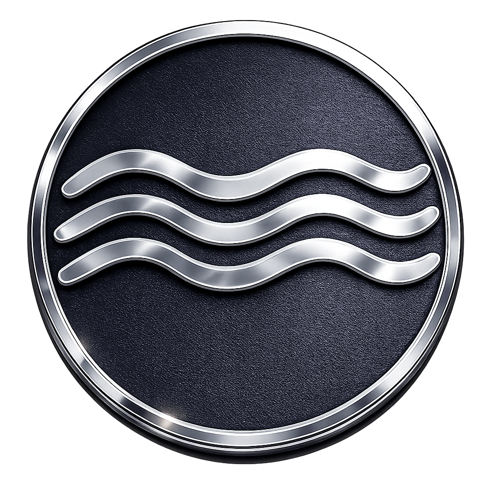

<!-- markdownlint-disable MD001 MD013 MD033 MD041 MD060 -->

<div align="center">



# Anclora Group

### Zentrales Unternehmensportal des Anclora-Ökosystems

Internes Portal, das Architektur, Governance und Dokumentation der gesamten Anclora-Produktfamilie integriert. Konzipiert als Referenz-Repository für Navigation, Qualitätskontrolle und operative Nachvollziehbarkeit.

[Español](./README.md) · [English](./README.en.md) · **Deutsch** · [Français](./README.fr.md)

<br />


</div>

---

> [!IMPORTANT]
> Internes Unternehmens-Repository. Dokumentiert Architektur und Governance des Anclora-Ökosystems; keine operativen Daten, Zugangsdaten oder sensible Logik außerhalb autorisierter Kanäle offenlegen.

## Was es ist

Anclora Group ist das zentrale Portal von Anclora, das als Konvergenzpunkt für Produktdokumentation, Markenstandards und technische Governance fungiert. Es dient als einzige Quelle der Wahrheit (SSOT) für Architektur, Nachvollziehbarkeit und Qualitätskontrolle im gesamten Ökosystem.

## Kategorie im Ökosystem

| Feld | Wert |
|---|---|
| Kategorie | Matrix-Entität |
| Markenakzent | `#A8AEB8` |
| Typografie | Georgia / Serif |
| Kanonisches Repository | `anclora-group` |

## Kernfunktionen

- Integriertes Portal für Unternehmensdokumentation und Governance
- Zentralisierte Navigation durch die Anclora-Produktfamilie
- Portalbereiche: Workspace (`/workspace`), App-Katalog (`/apps`), Architekturkarte (`/architecture`) und authentifizierte Dokumentation (`/docs`)
- Automatische PDF-Generierung (Architektur, Richtlinien)
- Verwaltung von Markenstandards und visuellen Verträgen
- Nachvollziehbarkeit und Audit operativer Änderungen

## Technologie-Stack

| Bereich | Technologie |
|---|---|
| Framework | Next.js 16 |
| Frontend | React 19, TypeScript |
| Hilfsmittel | lucide-react, pdf-lib, sharp |
| Tests | TSX |
| Linting | ESLint 9 |

## Lokaler Start

```bash
npm install
npm run dev
```

Dev-Server: `http://127.0.0.1:3005` (autoritativer Port, der diesem Repo auf dem VPS zugewiesen ist; überschreibbar mit `PORT`/`HOST`, z. B. `PORT=3100 npm run dev`). `npm run dev` ist plattformübergreifend (Linux/macOS/Windows) über `scripts/dev-safe.mjs`, das ein vorheriges `next dev` dieses Repos beendet und den Turbopack-Lock entfernt, bevor es startet; unter Windows delegiert es an `scripts/dev-safe.ps1`.

Lokale Validierung im Produktionsmodus (erfordert vorherigen Build):

```bash
npm run build
npm start
```

`npm start` serviert den Produktions-Build (Next-Standardport 3000, oder `PORT`, falls gesetzt). Es ist nicht der Entwicklungsbefehl.

## Unterstützte Sprachen

Die Produktoberfläche ist derzeit nur auf Spanisch verfügbar. Die Lokalisierungsinfrastruktur existiert (`es`, `en`, `de`, `fr` in `src/lib/group-ui.ts`), aber die Meldungen in `en/de/fr` sind Alias der spanischen Texte; echtes i18n ist eine künftige Phase. Diese Dokumentation wird auf Spanisch, Englisch, Deutsch und Französisch gepflegt.

## Dokumentation und Governance

- Marken- und Governance-Verträge: [`contracts/`](./contracts/) und [`docs/standards/`](./docs/standards/)
- Interne und Nutzeranleitungen: [`docs/claude-code/`](./docs/claude-code/)

---

<div align="center">

### Anclora Group

Interne Nutzung. Unternehmens-Governance-Portal des Anclora-Ökosystems.

</div>
